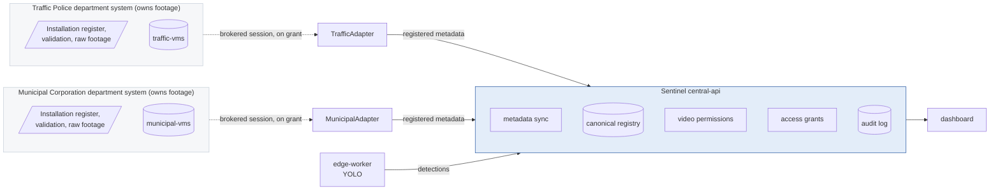

# Sentinel

**Vendor-neutral federation of independent CCTV/VMS systems.**

Sentinel gives a state-level operator one console over multiple department
CCTV registers — Traffic Police, Municipal Corporation, and any future
department system — without moving footage between them. Each department keeps
its own installation register, its own credentials and its own raw video.

The access model in one sentence:

> **Seeing that a camera exists is a federation question. Watching what it sees
> is the owning unit's decision.**

Camera metadata federates automatically: a unit fills in the installation form,
its own system validates it, and the camera appears in the central registry.
Footage does not federate. To watch a camera another unit owns, you ask that
unit, and someone there decides — a personal, time-boxed, revocable grant.

Full narrative: [`docs/access-model.md`](docs/access-model.md).
High-level design: [`docs/hld.md`](docs/hld.md).
Scaling to ~80,000 cameras: [`docs/scalability.md`](docs/scalability.md).

---

## Scope

**In scope**

- CCTV installation/onboarding form, held and validated by the owning department.
- Lifecycle `DRAFT → SUBMITTED → VALIDATION_FAILED | REGISTERED → SYNCHRONIZED
  → SUSPENDED / DECOMMISSIONED`. No approval stage.
- Canonical camera metadata schema, identical across every department system.
- Federation-wide registry, with cross-department reads capped at `standard`
  depth so a unit's internal operational data stays its own.
- Authorised video: brokered per session, opaque URL, watermarked,
  short-lived, re-authorised on every read, fully audited.
- Cross-unit video access requests — ask, grant, deny, revoke.
- Camera health federation (status, last frame, latency, reconnects).
- Generic object detection (person / vehicle class / bicycle) running at the
  edge, continuously and across many cameras, with results in the dashboard.
- **ANPR** — number-plate reading at the edge, off by default, behind its own
  `plate:read` permission, with shorter retention and audited disclosure. The
  reader is a consensus engine: it tracks each vehicle, reads its plate across
  every frame the vehicle appears in, repairs each reading against the Indian
  plate grammar, and votes.
- **Watchlist matching and real-time alerts** — an ingested plate is matched
  against the active watchlist as it arrives, tolerating OCR error, and a hit
  raises an alert. Four separate permissions; every act audited.
- **Cross-camera movement history** — where one registration number has been
  seen, in time order, on a map. Built from plate reads only, and a trace needs
  a stated reason that is recorded against the account.
- Standalone vehicle reference registry, deliberately **not** joined to
  detections or sightings.
- Complete audit trail of onboarding, synchronisation, metadata reads, footage
  requests, decisions, sessions and refusals.
- Two federated department mock systems, each with a deliberately different
  API dialect.

**Out of scope**

- Face recognition, biometric identification, gait recognition.
- Make-model-colour verification, and vehicle re-identification by appearance.
  A track is built from **plate reads only**: a vehicle whose plate was not read
  contributes nothing to its own route, which understates movement rather than
  inventing it.
- Any join between a sighting and the vehicle reference registry.
- VAHAN / Dharmik integration.
- Automatic enforcement actions. An alert reaches a human, and stops.
- Retroactive alerting. Matching happens at ingest, so a watchlist entry added
  after a vehicle passed does not manufacture an alert for that pass.
- Real-department integration or scraping. Every input is synthetic. The
  official-source provider exists as a documented shape and is inert until an
  authorised URL and token are configured.

---

## Architecture



Each department:

- runs its own installation register and validates its own forms;
- holds its own raw video, NVR credentials, RTSP URLs and local access policy;
- decides whether Sentinel may broker each camera at all, and who from outside
  may watch it.

Sentinel:

- normalises every department dialect (vocabulary, timestamps, envelopes) into
  one canonical shape;
- never stores a stream URL, NVR address, credential or media token — a
  permitted session is proxied through an opaque `/api/v1/streams/{id}`;
- enforces role, department, city, zone, camera state and grant on every
  footage request, and audits every outcome including the refusals.

---

## How federation works

1. A department installer completes the CCTV installation form. It is stored
   **in that department's system** as a `DRAFT`.
2. The installer submits it. That department validates every field — required
   fields, coordinates inside its jurisdiction, no duplicate device ID, a
   non-empty local-role list.
3. Failure returns `VALIDATION_FAILED` with the department's own error list;
   correct and resubmit. Success registers the camera immediately.
4. Sentinel synchronises. `REGISTERED` and `SYNCHRONIZED` records cross the
   adapter boundary; drafts and failed validations are counted and skipped.
   Suspended and decommissioned assets are kept and marked `unavailable`, so
   the register never loses a withdrawn camera.
5. Every unit can now see the camera. To watch it, a unit that does not own it
   raises a video access request with a reason; the owning unit grants, narrows
   or denies it.

The adapter pattern makes vendor differences invisible above the boundary. The
Traffic system speaks flat snake_case with IST wall-clock strings and an
`X-API-Key` header; the Municipal system speaks nested camelCase with epoch
milliseconds and a bearer token. Sentinel's routers and the dashboard see the
same canonical `Camera` model either way. See
[`docs/adapter-contract.md`](docs/adapter-contract.md).

---

## Roles

| Role | Highlights |
|---|---|
| `installation_operator` | raises, edits and submits installation forms |
| `traffic_operator`, `municipal_operator` | view their own unit's footage; may request others' |
| `city_admin` | one city, across departments |
| `department_admin` | one department, in full |
| `state_admin`, `state_registry_viewer` | statewide registry, health and policy |
| `health_monitor` | statewide health only — no maintenance or vendor detail |
| `ai_operator` | ingests detections from the edge worker; deliberately holds no watchlist, alert or track permission |
| `vehicle_registry_viewer` | the standalone vehicle reference set, and nothing else |
| `system_admin` | registry and sync at platform level; holds video on every camera, so the broker can be verified end to end |
| `auditor` | statewide audit-log access; reads the watchlist, alerts and traces, but edits none of them |
| `grid_operator` | the live sandbox grid — live video only, plus plates, alerts and traces on it |

Local roles (each department's own VMS vocabulary) are recorded on the
access-policy summary. Sentinel does not grant them and never receives a token
for any of them.

---

## Running the demo

Prerequisites: Docker 24+, Docker Compose v2, ~1.5 GiB of build cache.

```bash
docker compose up --build
```

Once every service is healthy:

- Dashboard <http://localhost:3000> — sign in from
  <http://localhost:3000/login>. Demo accounts are listed on the sign-in page.
- Central API <http://localhost:8000/docs>
- Traffic VMS mock <http://localhost:8001/docs>
- Municipal VMS mock <http://localhost:8002/docs>

Environment variables you may want to override are documented in
[`.env.example`](.env.example). Edge-worker and model setup:
[`docs/yolo-setup.md`](docs/yolo-setup.md).

To run object detection against the registry's cameras from this machine:

```powershell
.\scripts\edge-worker.ps1 --all-cameras --forever
```

(`./scripts/edge-worker.sh` on macOS/Linux.) Results appear under
**Object detections** in the dashboard.

---

## Demonstration accounts

Every credential is synthetic. Passwords deliberately stay simple for the demo.

| Username | Password | Role | Scope |
|---|---|---|---|
| `state.admin` | `State@2026` | State admin | All |
| `registry.viewer` | `Registry@2026` | State registry viewer | All |
| `health.monitor` | `Health@2026` | Health monitor | All (limited fields) |
| `vehicle.registry` | `Vehicle@2026` | Vehicle registry viewer | Reference data only |
| `auditor` | `Auditor@2026` | Auditor | All |
| `system.admin` | `SysAdmin@2026` | System administrator | All |
| `ahmedabad.cityadmin` | `City@2026` | City admin | Ahmedabad |
| **`traffic.state`** | `Traffic@2026` | Traffic operator | **Traffic Police, statewide** |
| **`municipal.state`** | `Municipal@2026` | Municipal operator | **Municipal Corp., statewide** |
| `traffic.operator` | `Traffic@2026` | Traffic operator | Traffic Police, Ahmedabad Zones 1-2 |
| `traffic.zone3` | `Traffic@2026` | Traffic operator | Traffic Police, Zone 3 only |
| `municipal.operator` | `Municipal@2026` | Municipal operator | Municipal Corp., Ahmedabad |
| `dept.admin` | `DeptAdmin@2026` | Department admin | Traffic Police |
| `municipal.deptadmin` | `DeptAdmin@2026` | Department admin | Municipal Corp. |
| `ai.operator` | `AiOps@2026` | AI operator | Traffic Police, Ahmedabad |
| `traffic.ai` | `AiOps@2026` | AI operator | Traffic Police, statewide |
| `municipal.ai` | `MuniOps@2026` | AI operator | Municipal Corp., Ahmedabad |
| `traffic.installer` | `Install@2026` | Installation operator | Traffic Police |
| `municipal.installer` | `Install@2026` | Installation operator | Municipal Corp. |

The two **statewide** accounts are the ones to use for the live grid: those
cameras span nine districts, and the city- and zone-limited accounts above are
deliberately narrow because they are what demonstrates that scope is enforced.

There is no separate approver role. `video:grant` sits with the operators who
run a unit's cameras, so **the operator is the approver** — see below.

---

## Demo script

See [`docs/demo-script.md`](docs/demo-script.md) for the full walkthrough. In
summary: raise a Traffic form → submit → watch it register with no approval
step → synchronise → sign in as `municipal.operator` and find the Traffic
camera already in the registry → try to watch it and get
`needs_unit_approval` → request access with a reason → grant it as
`traffic.state`, the operator who owns the camera → watch the watermarked
session → revoke it and watch the stream stop → open the audit log and show
the whole conversation.

---

## Testing the access boundary

A camera you do not own is visible but not viewable:

```bash
curl -s -X POST http://localhost:8000/api/v1/video-sessions \
  -H "Authorization: Bearer $TOKEN" -H 'Content-Type: application/json' \
  -d '{"camera_id":"SENTINEL-MUNICIPAL-AHM-0101","mode":"live","reason":"demo"}' | jq .detail
# { "code": "VIDEO_ACCESS_DENIED", "state": "needs_unit_approval",
#   "owning_department": "Municipal Corporation",
#   "request_access_at": "/api/v1/video-access-requests" }
```

`tests/test_video_access.py` and `tests/test_video_grants.py` enforce this at
the permission, session, stream, grant and audit-trail levels — including that
a grant is personal, expires, can be narrowed to playback only, and stops a
running stream when revoked.

---

## Testing source failure

Sentinel isolates department outages: one system going down never breaks the
other.

```bash
docker compose stop municipal-vms
```

Refresh the overview page:

- Traffic Police cameras stay online. Their metadata reads keep working.
- Municipal Corporation cameras become `offline` with an explanatory reason.
- The department-systems row for the Municipal Corporation turns red.
- Installation listings degrade to the last mirrored state rather than failing,
  and say so via `X-Sentinel-Degraded`.

```bash
docker compose start municipal-vms
```

Click **Synchronise metadata** on the overview page. Municipal cameras recover
and every failed poll during the outage is in the audit log.

---

## Running the tests

```bash
pip install -r services/central-api/requirements.txt pytest pytest-asyncio
pytest tests
```

183 tests cover installation onboarding and validation, ownership and
permission, registration-gated sync, source-outage isolation, canonical
normalisation, redaction depth, the full video permission matrix, cross-unit
grants, recorded-playback windows and retention, detection ingestion and
scoping, the vehicle registry, every rule in the sandbox grid's integrator
guide, the plate matcher and its thresholds, watchlist permissions and
alerting, cross-camera route reconstruction, and the edge-worker's detector,
consensus ANPR engine and frame-quality routing.

Nine of those run **real YOLO inference** over the bundled CCTV clip. They skip
automatically unless the analytics extras and weights are installed — see
[`docs/yolo-setup.md`](docs/yolo-setup.md). Four video-streaming tests need the
bundled `.mp4` fixtures, which are gitignored; they fail on a fresh clone until
those are placed under `data/videos/`.

---

## Repository layout

```
sentinel-module1/
├── services/
│   ├── central-api/          # Sentinel middleware (FastAPI + SQLAlchemy 2)
│   ├── traffic-vms/          # Mock Traffic Police department system
│   ├── municipal-vms/        # Mock Municipal Corporation department system
│   ├── edge-worker/          # YOLO inference and consensus ANPR at the edge
│   │   ├── app/              # worker, grid capture, detectors, engine adapter
│   │   └── anpr/             # vendored consensus ANPR engine
│   └── dashboard/            # Next.js 14 registry console
├── docs/                     # Access model, adapter contract, API, ANPR, grid,
│                             # scalability, demo script, YOLO setup
├── tests/                    # pytest suite
├── docker-compose.yml
└── .env.example
```

Every input, every camera and every account in this repository is synthetic and
labelled as such. Sentinel does not connect to any real government CCTV system,
and the official-source provider refuses rather than guesses until authorised
access is configured.
