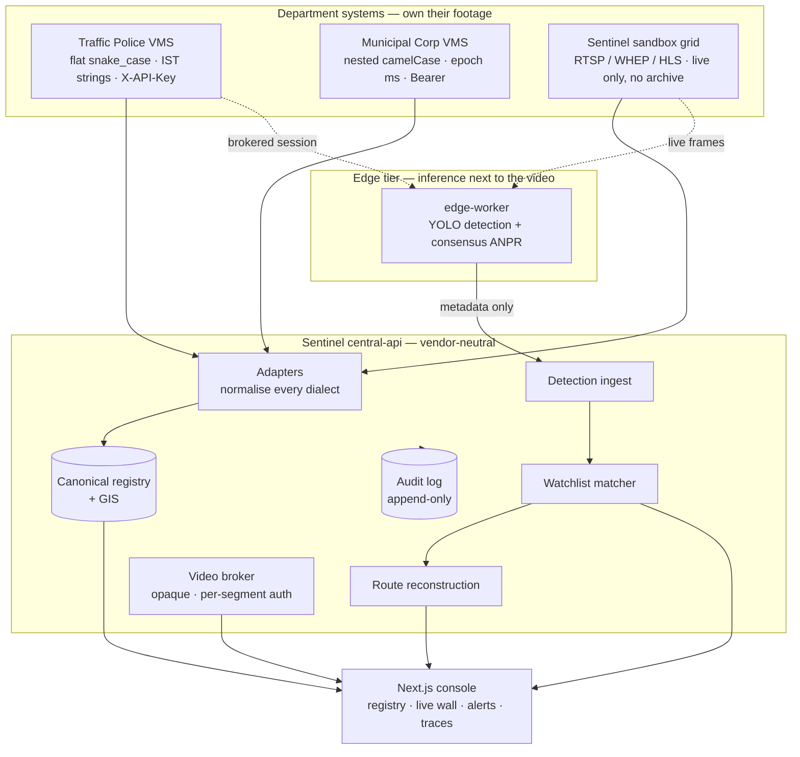

# Sentinel — High-Level Design

Submitted for the Gujarat Police Innovation Challenge 2026, CCTV Integration
Hackathon.

**Proposed model:** Reference **Model 1 + Model 3**, with the Model 2 viewing
surface layered on top — a hybrid, and §2 says why that combination rather than
any single model.

This document describes a system that runs. Every component below is
implemented, tested and demonstrable; where something is estimated rather than
measured, or planned rather than built, it is marked. A design document that
does not distinguish the two is not useful to whoever has to deploy it.

---

## Contents

1. [The problem, restated](#1-the-problem-restated)
2. [Model choice and justification](#2-model-choice-and-justification)
3. [System architecture](#3-system-architecture)
4. [Integrating heterogeneous CCTV](#4-integrating-heterogeneous-cctv)
5. [Video ingestion and stream handling](#5-video-ingestion-and-stream-handling)
6. [AI and video analytics](#6-ai-and-video-analytics)
7. [Watchlist correlation and alerting](#7-watchlist-correlation-and-alerting)
8. [Cross-camera movement reconstruction](#8-cross-camera-movement-reconstruction)
9. [Security architecture](#9-security-architecture)
10. [Deployment architecture](#10-deployment-architecture)
11. [Scalability](#11-scalability)
12. [What departments must provide](#12-what-departments-must-provide)
13. [Assumptions and known limitations](#13-assumptions-and-known-limitations)

---

## 1. The problem, restated

26 Government departments run independent CCTV systems: mixed analog and IP
cameras, multiple VMS vendors on different AMC periods, cloud storage in some
places and local storage in others, retention ranging from 7 days to 15 or
more, sites spread across roughly 1,000 kilometres. None of them can see each
other's cameras, and none of them can correlate what a camera sees against the
databases that would make it actionable.

The requirement is one platform over all of it — searchable, analysed, alerting
in real time — that scales toward 80,000 cameras without a redesign.

The constraint that shapes every decision below is that **the departments keep
running their own systems**. A design that requires 26 departments to migrate
onto one VMS before anything works is a design that produces nothing for three
years. Sentinel is built so that the first department to federate gets value on
the day it does, and the twenty-sixth changes nothing about how the first works.

## 2. Model choice and justification

| Model | Verdict | Why |
|---|---|---|
| **1 — Registry & GIS** | **Adopted in full.** Mandatory, and correct. | Nothing else can be built without knowing which cameras exist, where, owned by whom, in what state of repair. It is also the only part that delivers value with no analytics at all: an accurate statewide inventory with coverage-gap analysis is useful on day one, and nobody has one today. |
| **2 — Unified viewing** | **Adopted as a surface, not as the integration.** | Operators need one console — that part is right. Connecting the console *directly* to 26 departmental VMS platforms is not: it puts vendor-specific logic in the viewer and means every new vendor is a change to the thing operators use. |
| **3 — VMS federation middleware** | **Adopted as the integration.** | An adapter per vendor, normalising to one canonical model, is what makes vendor differences invisible above the boundary and lets a department be onboarded without touching anything downstream. |
| **4 — Central VMS** | **Rejected, deliberately.** | Centralising 80,000 video streams is ~160 Gbps sustained and ~1.7 PB/day. `docs/scalability.md` §2 shows the arithmetic. It also concentrates every camera credential in one place and makes ambient statewide viewing the default, which is the worst available privacy posture. Inference goes to the video instead. |

**So: Model 1 as the foundation, Model 3 as the integration layer, Model 2's
console as the surface, and analytics at the edge.** Video is pulled on demand
per authorised session, never streamed centrally by default.

## 3. System architecture



**The line that matters** is between the edge tier and the central tier. Frames
never cross it. What crosses is a class name, a confidence, a box, a timestamp,
provenance and — where ANPR is enabled and permitted — plate characters. The
central API has **no computer-vision dependency at all**, which keeps it small
enough to deploy anywhere and means a compromise of it yields no imagery.

| Component | Stack | Status |
|---|---|---|
| central-api | FastAPI, SQLAlchemy 2 (async), PostgreSQL | Running |
| Adapters | One per source system, common ABC | Running — 3 sources |
| edge-worker | Python, Ultralytics YOLO, PaddleOCR, OpenCV | Running |
| Consensus ANPR | Vendored `anpr/` package | Running |
| Dashboard | Next.js 14, React 18, Tailwind, Leaflet + OpenStreetMap | Running |
| Storage | PostgreSQL (JSONB); SQLite for the test suite | Running |

All open source. No vendor account, no API key, no licensed component — the
map is OpenStreetMap, the models are open weights.

## 4. Integrating heterogeneous CCTV

The adapter is the whole answer, and the two mock departments exist to prove it
against genuinely incompatible dialects rather than against a convenient one:

| | Traffic Police | Municipal Corporation | Sentinel grid |
|---|---|---|---|
| Field style | flat `snake_case` | nested `camelCase` | flat, minimal |
| Timestamps | IST wall-clock strings | epoch milliseconds | absent |
| Auth | `X-API-Key` header | `Bearer` token | none (public sandbox) |
| Installation register | yes | yes | **none** |
| Recorded archive | yes | yes | **none** |

Every one normalises to the same canonical `Camera`. Above the adapter
boundary, the routers and the dashboard cannot tell them apart.

Three properties that took deliberate work:

- **Read-only sources are read-only in code.** The grid has no installation
  register, so every write in its adapter refuses locally with
  `SourceConflictError` rather than issuing a request that should never be
  made, and `list_installation_requests()` returns `[]` because the register
  genuinely does not exist — not because a call failed.
- **Capability is enforced twice.** Grid cameras advertise `live` and never
  `playback`, *and* the video adapter refuses a playback request outright. Two
  independent gates, because "there is no recording" should not depend on
  either one alone.
- **A source outage is isolated.** One department going down leaves the others
  fully working; its cameras go `offline` with a stated reason, listings
  degrade to the last mirrored state and say so via `X-Sentinel-Degraded`, and
  every failed poll is in the audit log. Demonstrable with
  `docker compose stop municipal-vms`.

Onboarding a new vendor is: implement the ABC, add a config entry, sync. The
checklist is `docs/adapter-contract.md`.

## 5. Video ingestion and stream handling

**For inference,** the edge worker captures live, directly, following the
sandbox integrator's guide. Every rule in it is enforced in code and pinned by
a test that runs against a fake capture — so the rules hold whether or not the
sandbox is reachable, which matters because a rule only checked when the feed
is up is not really checked:

RTSP forced over TCP · timing driven from PTS and never arrival time ·
`CAP_PROP_FPS` never read anywhere · inter-frame gaps tolerated · reconnect
with 2 s→30 s backoff · join-time decoder noise tolerated for 25 frames ·
per-camera codec and resolution read from `/api/ingest` · scene discontinuity
detected and long-lived state reset · nothing written to disk · no write verb
anywhere in the module · one capture per camera, released on exit.

The PTS rule is the one that silently ruins a tracker: the gateway replays a
buffered GOP on connect, so the first second arrives faster than real time and
anything timestamping by arrival computes impossible velocities after every
reconnect.

**For human viewing,** video is brokered. The browser never learns the upstream
host exists:

```
browser → /api/v1/streams/{session_id}          (authorised, audited)
        → /api/v1/streams/{session_id}?p=<ref>  (each segment re-enters)
                ↓ server-side only
          upstream HLS / RTSP
```

Every URI in every playlist is rewritten — bare lines and `URI="…"` attributes
on `EXT-X-MAP`, `EXT-X-PART`, `EXT-X-KEY` and friends — to a **relative**
`?p=<ref>`, so the rewrite stays correct behind any reverse proxy without the
service knowing its own public prefix. Because every segment re-enters the same
route, **authorisation is re-checked per segment**: revoking a grant stops a
playing stream within one segment, not at session expiry. `p` arrives from the
browser and is treated as hostile — a scheme, an authority, a leading `/` or a
`..` is refused rather than normalised, because a permissive resolver there
would turn the broker into an open forward proxy.

## 6. AI and video analytics

**Object detection.** YOLO11n at the edge over the canonical vocabulary
(person, car, motorcycle, bus, truck, auto-rickshaw, bicycle). COCO classes
outside that map are discarded rather than guessed at. A frame-quality router
classifies each frame first and skips ones too degraded to mean anything,
recording that it did so rather than producing noise.

**ANPR — a consensus engine, not a per-frame OCR call.** This is the part that
determines whether the graded test case works at all, so it is worth being
precise about what it does:

```
frame
  ├─ vehicle detector (YOLOv8n + ByteTrack) ──► stable track id per vehicle
  ├─ plate detector (YOLO11m, plate-finetuned)
  │     ├─ full-frame pass
  │     └─ ROI pass inside each vehicle box, upscaled   ← finds distant plates
  ├─ quality assessment    resolution · sharpness · exposure · clipped glare
  ├─ restoration           only the branches the defects call for
  │     ├─ perspective rectification      (angled CCTV views)
  │     ├─ CLAHE + unsharp                (always)
  │     ├─ low-light branch               (gamma lift → denoise → CLAHE)
  │     ├─ glare branch                   (inpaint clipped pixels → retinex)
  │     ├─ super-resolution ESPCN ×4      (plates under ~140 px wide)
  │     └─ adaptive binarisation          (flat, washed-out crops)
  ├─ OCR ensemble          every variant read independently (PP-OCRv5)
  ├─ grammar engine        Indian plate formats + confusion-aware repair
  └─ consensus             per-track voting across frames ──► final plate
```

The two layers carrying the accuracy are the **grammar engine** and the
**consensus vote**, not the OCR model:

- **Grammar.** Indian plates have rigid formats, so a character's *position*
  says whether it must be a letter or a digit. `GJ05JV34S6` is unambiguously
  `GJ05JV3456`, because slot 8 cannot hold a letter. Repair is a bounded search
  over one-to-many confusion sets, constrained by the format regex *and* the
  real state-code list, picking the cheapest fix — which is how `0L8CAF5030`
  recovers to `DL8CAF5030`. Formats covered: standard `GJ 01 AB 1234`, Delhi's
  single-digit district, Bharat series, diplomatic, and older short-tail plates.
  A soft Gujarat prior breaks ties without preventing other states validating.
- **Consensus.** A plate is emitted **once per vehicle**, with the count of
  frames that agreed. That count travels to the operator's screen, because one
  frame is a guess and twelve frames agreeing is a reading.

Everything that does not parse as a plausible Indian registration is dropped at
the edge and never transmitted, then checked again centrally. Half-read text is
worse than no text: it looks like evidence and is not.

## 7. Watchlist correlation and alerting

```
plate read ──► sighting (one vehicle, one camera, one instant)
                   │
                   ├──► matched against the ACTIVE watchlist, at ingest
                   │         confusion-weighted distance ≤ 1.0
                   │
                   └──► alert (category, distance, exact?) ──► console + audit
```

**Matching happens at ingest, not at query time.** An alert asserts that the
system knew at a moment in time, and a query-time matcher cannot make that
claim. It also means a watchlist entry added *after* a vehicle passed does not
manufacture an alert for that pass — correct, and the surprising half of the
behaviour, so it is tested explicitly.

**Matching is fuzzy, and the pricing is the design.** Exact-match lookup over
OCR output is a trap: if the only camera that saw a vehicle read one character
wrong, an exact query returns nothing and the vehicle looks like it was never
there. But plain edit distance is too blunt, so:

| Operation | Cost | Why |
|---|---|---|
| Known confusion pair (B↔8, O↔0, …) | 0.35 | What the reader actually gets wrong |
| Unrelated substitution | 1.0 | Usually a different vehicle |
| Insertion / deletion | 0.5 | A character lost to glare or a frame edge is commonplace; a *different* digit in its place is not |

Threshold 1.0 — about two plausible OCR errors. Raising it does not find more
stolen vehicles; it finds more innocent ones.

Alerts carry `exact` separately from `distance`, because an operator acts
differently on the two. Near matches are shown by default; suppressing them to
keep a console tidy is how a stolen vehicle passes a camera and nobody hears.

## 8. Cross-camera movement reconstruction

Given a registration number: every sighting the caller is permitted to read,
ordered by time, with per-leg distance, elapsed time and implied speed, drawn
on a Leaflet map.

Four behaviours worth stating, because each is a decision:

- **Built from plate reads only.** No appearance matching, no re-identification
  by colour or shape, no join to the vehicle reference registry. A vehicle
  whose plate was not read contributes nothing to its own route — which
  understates movement rather than inventing it, and that is the right
  direction to be wrong in.
- **Repeated reads at one camera collapse into one pass.** A vehicle waiting at
  a signal would otherwise produce a dozen points and a route that looks like
  frantic activity in one spot.
- **Impossible legs are flagged, never dropped.** A leg implying >200 km/h
  usually means one of the two reads belongs to a different vehicle. That is a
  finding about the route's reliability, surfaced in the API, the table and the
  map in red. Removing it would make the line look cleaner and be less true.
- **Scope is applied before assembly.** A route is never built from a sighting
  the caller could not have read. Filtering afterwards would leave holes that
  look like the vehicle disappeared rather than like permissions ending.

Every trace requires a written reason, enforced at the API, recorded against
the account with the plate and the time.

## 9. Security architecture

| Control | Implementation |
|---|---|
| Credentials never centralise | Sentinel stores no RTSP URL, no NVR address, no credential, no media token. A breach of the central tier yields no key to any camera. |
| Sessions are brokered and opaque | Short-lived, watermarked, re-authorised **per segment**. |
| Three-dimensional scope | Department, city, zone — checked per request, plus the camera's own policy. |
| Cross-unit access is asked for | Personal, time-boxed, revocable grants. The operator who runs a unit's cameras is the approver; there is no separate approval role to route around. |
| Least privilege, finely split | 13 roles, 22 permissions. `plate:read`, `watchlist:read`, `watchlist:manage`, `alert:read`, `alert:acknowledge` and `track:read` are all separate — the edge account that *ingests* plates holds none of the read permissions, because a worker that can read the watchlist back is a worker that can exfiltrate it. |
| Field-level redaction | Three visibility depths. Cross-department reads are capped so a unit's internal operational data stays its own. |
| Withheld, not refused | An account without `plate:read` still gets the alert, with `plate_withheld: true`. The operational fact and the identifying fact are separable, so they are separated. |
| Retention enforced on read | Plates have their own shorter clock, applied at read time as well as by any purge — so a failed purge cannot quietly extend availability. |
| Complete audit trail | Every onboarding step, sync, metadata read, footage request, decision, session, refusal, plate disclosure, watchlist change, alert raised and trace run. Rows commit independently of the request that produced them, because a denied attempt is the record you most want to survive. |
| Machine decisions audited too | `watchlist_alert_raised` is written by the matcher, not by a person. The trail shows what the system concluded as well as what people did. |

Verified by 183 automated tests, including a permission matrix that asserts
refusals as carefully as it asserts successes, and a secret-scanner that fails
the build if an RTSP URL, credential or internal hostname appears in any
client-facing payload.

## 10. Deployment architecture

```
                       ┌──────────────┐
                       │  Dashboard   │  Next.js, httpOnly session cookie
                       └──────┬───────┘
                              │  /api/sentinel/* (server-side proxy)
                       ┌──────▼───────┐
                       │ central-api  │  N replicas, stateless for ingest
                       └──────┬───────┘
              ┌───────────────┼───────────────┐
        ┌─────▼─────┐   ┌─────▼─────┐   ┌─────▼─────┐
        │PostgreSQL │   │ Adapters  │   │Audit store│
        │ + standby │   │ per source│   │append-only│
        └───────────┘   └─────┬─────┘   └───────────┘
                              │
                 ┌────────────┴────────────┐
            ┌────▼────┐              ┌─────▼────┐
            │ Dept A  │   …          │  Dept N  │   each with its own
            │ VMS+NVR │              │ VMS+NVR  │   edge-worker fleet
            └─────────┘              └──────────┘
```

Everything is containerised. `docker compose up --build` brings up the whole
demonstration stack. The edge worker has three build targets — `base` (mock
detector, ~120 MB, for CI), `yolo` (real inference, ~2.5 GB) and `anpr`
(consensus reader, ~3.5 GB) — so a site pulls only what it will run. Weights
are mounted, never baked in.

## 11. Scalability

Summarised; the arithmetic is in [`docs/scalability.md`](scalability.md).

| | |
|---|---|
| Central video streaming at 80k cameras | ~160 Gbps, ~1.7 PB/day — **rejected** |
| Sentinel's metadata-only crossing | ~600 Mbps – 1 Gbps — **40–250× less** |
| Edge accelerators, ANPR only where the optics allow it | ~3,000 *(estimate)* |
| Detection retention | hot 30 d / warm 1 y / cold 7 y, plates on a shorter clock |

Three things that do not scale as written are named explicitly in that document
along with their replacements: fuzzy plate search is O(n) in Python and needs a
`pg_trgm` prefilter; the watchlist matcher loads the full active list per batch
and needs a bloom filter for the common negative case; and coordinates are
plain floats rather than PostGIS, which the tracking work will want.

Rollout is phased so each phase is useful alone: ~50 cameras (this hackathon) →
~2,000 across three districts → ~15,000 Home Department statewide → ~80,000 all
departments. Model 1 deploys first and in full at every phase, because an
accurate statewide inventory with gap analysis is valuable on the day it exists
and nobody currently has one.

## 12. What departments must provide

To assess integration feasibility for a department, we need:

1. **VMS make, model and version**, and whether an API, SDK or ONVIF endpoint
   is exposed.
2. **Camera inventory** — device ID, make/model, analog or IP, resolution,
   codec, coordinates, view direction, purpose.
3. **Feed access method** — RTSP path convention, ONVIF profile, or vendor SDK,
   plus which ports are reachable from the department network.
4. **Retention policy and storage location** per camera group.
5. **AMC status and expiry**, because it determines whether a camera can be
   reconfigured at all.
6. **Local role vocabulary** — who may view what inside the department today.
7. **A technical contact** who can authorise a test integration.

Sentinel needs none of these to *list* a department's cameras — bulk CSV
onboarding populates the registry from a spreadsheet. They are needed to move
from registry to feed integration.

## 13. Assumptions and known limitations

Stated plainly, because a design document that lists only strengths is not one
a deploying engineer can trust.

**Assumptions**

- Departments retain their own VMS, storage and access policy. No migration is
  required or assumed.
- Camera coordinates are provided by the department or surveyed. The sandbox
  grid publishes none, so ours are compiled from three evidence sources with a
  recorded `geo_confidence` per camera — a map pin never implies more precision
  than it has.
- Analytics run at the edge, inside the department environment that already
  holds the video.

**Limitations**

- **ANPR yield on wide overview footage is low, and that is optical.** A camera
  positioned for ANPR reads plates well; a general-purpose overview camera does
  not. The measured 1-in-67 figure in `docs/anpr.md` is for the *fallback*
  single-frame reader; the consensus engine has not yet been measured on the
  government feed, and we are not quoting a number for it until it has been.
- **Cross-camera tracking depends entirely on plate reads.** A vehicle whose
  plate is never read does not appear on its own route.
- **The metadata bus is direct HTTP, not Kafka.** Defensible at this scale and
  named as a Model 3 feature we have not implemented; §11 sets out where it
  changes.
- **Coordinates are plain floats, not PostGIS.** Fine for the map we render;
  a limitation for corridor and proximity queries.
- **Edge buffering for low-connectivity sites is designed but not built.** The
  hard part — deterministic detection IDs and idempotent ingest — is done and
  tested; the local queue is not.
- **All demonstration data is synthetic and labelled as such.** The
  official-source provider exists as a documented shape and refuses rather than
  guesses until an authorised URL and token are configured. Sentinel does not
  connect to VAHAN, SARTHI, eGujCop, AFIS or NAFIS; those integrations are
  designed for and gated behind exactly the same permission and audit machinery
  the watchlist already uses.
